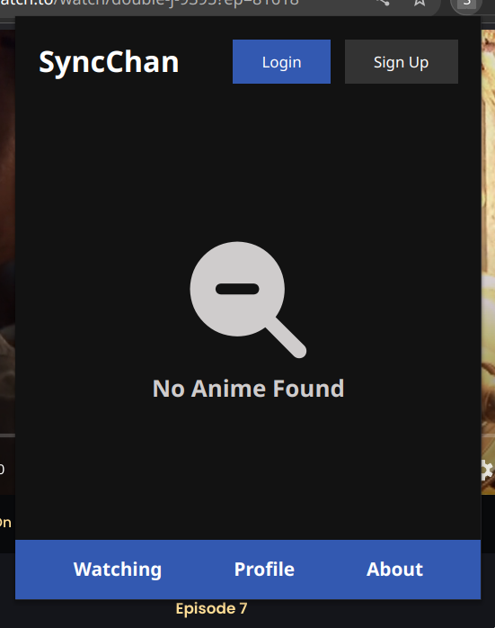

# Sync Chan

It was supposed to be an chrome extension to easily sync currently watching anime with MyAnimeList. But I recently found out that a similar project already exist [MALSync](https://github.com/MALSync/MALSync). 

Due to it, I decided to stop the development of this project. 

# Learnings

- How to create a chrome extension
- How to use the chrome storage API
- How to use the chrome message passing API
- How to use the chrome tabs API

# Images

---

